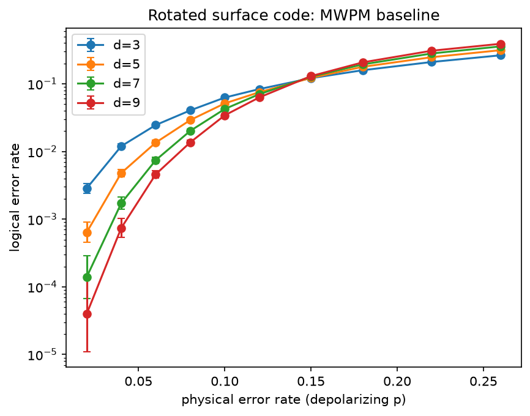
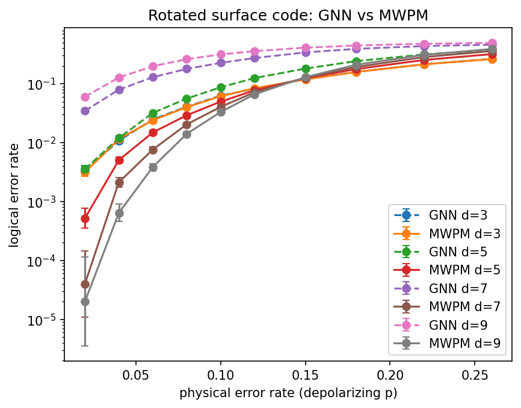
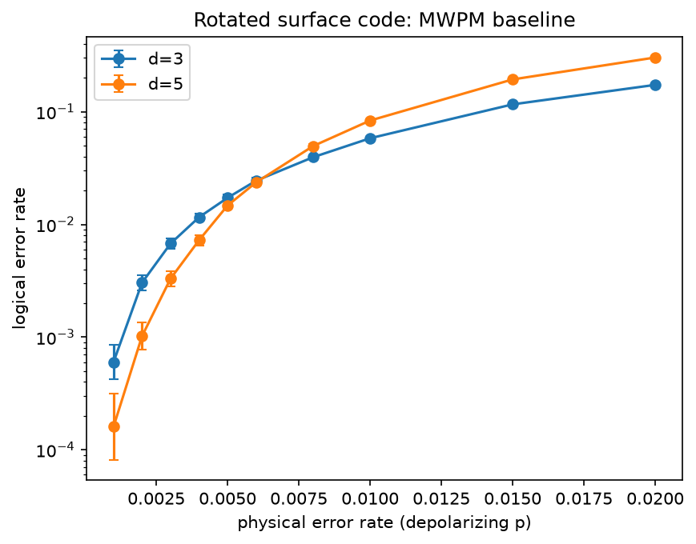
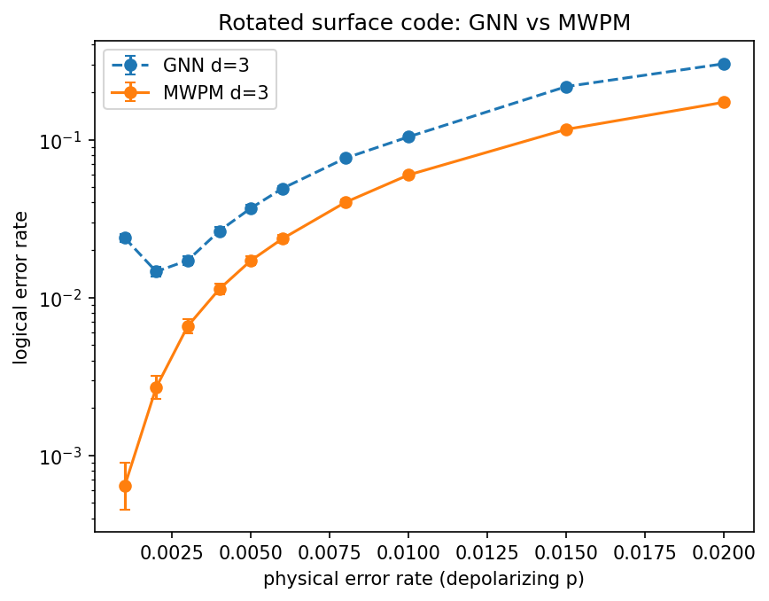

# qecdecoder

A graph neural network decoder for quantum error correction, benchmarked
against the classical Minimum Weight Perfect Matching (MWPM) baseline.

This is an ongoing research project. The goal is to train a GNN decoder for
the surface code, rigorously compare it against MWPM (via
[PyMatching](https://github.com/oscarhiggott/PyMatching)) on logical error
rate and decode latency, and publish both the code and a benchmark
report/preprint.

## Status

**Phase 1 complete**: simulation + baseline pipeline validated. The
end-to-end `simulate -> decode -> benchmark` pipeline is tested against a
closed-form theoretical logical error rate for the repetition code (where
MWPM decoding is provably optimal and reduces to majority vote). This gives
confidence the pipeline is correct before moving to the surface code, where
no simple closed form exists.

**Phase 2 complete**: MWPM baseline on the rotated surface code (d=3, 5, 7,
9 -- extended from just d=3,5 in Phase 5, since code-capacity graphs stay
small even at d=9) under code-capacity-style depolarizing noise. Logical
error rate vs. physical error rate, with Wilson-interval error bars:



All 4 curves cross close to the same point, p ~ 0.135-0.147 depending on
which adjacent pair you look at -- below that, larger codes outperform
smaller ones (as expected below threshold); above it, the ordering flips.
This crossing-point estimate is a quick visual-threshold check, not a
rigorous finite-size-scaling fit, but 4 distances agreeing this closely is
a meaningfully stronger signal than the original 2-distance estimate.

Reproduce: `uv run qecdecoder sweep experiments/configs/phase2_mwpm_sweep.yaml --name phase2_mwpm_sweep`

**Phase 3 complete (v1)**: a GNN decoder (message passing over the decoding
graph derived from Stim's `DetectorErrorModel`, PyTorch Geometric),
benchmarked against the same MWPM baseline on the same d=3/d=5 grid:



GNN d=3 essentially matches MWPM across the whole range, including
physical error rates it never saw during training. GNN d=5 is consistently
a bit behind MWPM but tracks it smoothly and monotonically.

That "smoothly" is the interesting part: the first version of this model
was trained at a single physical error rate (p=0.10) and generalized badly
away from it -- for d=5 the logical-error-rate-vs-p curve was
*non-monotonic* (worse at p=0.06 than at p=0.10), reproduced identically on
both CPU and a Colab GPU run, ruling out randomness. The fix was training
across multiple physical error rates (`[0.04, 0.08, 0.12, 0.18, 0.24]`,
deliberately leaving several eval-grid points out as an
interpolation/extrapolation check) so the model learns a rate-conditioned
decision boundary from the DEM edge weights instead of overfitting to one
noise level's syndrome statistics. That single change took d=5 from
"unusable, non-monotonic" to "smooth, modestly behind MWPM" -- the plot
above is the fixed version.

One real edge case found and fixed along the way: at `physical_error_rate
== 0` there are no error mechanisms at all, so the decoding graph has zero
edges -- entirely out-of-distribution for a model trained on graphs that do
have edges. The decoder now special-cases this to the only correct answer
("no flip") instead of running the model on a degenerate graph.

Reproduce (GPU strongly recommended -- see below):
`qecdecoder gnn-benchmark experiments/configs/phase3_gnn_benchmark.yaml --device cuda --name phase3_gnn_benchmark`

**Phase 4a complete (v1)**: circuit-level noise (gate, idle, measurement,
and reset errors, not just data-qubit noise) -- a much more realistic
threat model than Phase 2/3's code-capacity noise. MWPM baseline:



Threshold ~0.6%, about 20x lower than code-capacity's ~14% -- expected: a
single circuit-level noise parameter stands in for many more failure
modes (every gate, every idle step, every measurement) than one
data-qubit-only channel, and matches literature values (~0.5-1%) for this
kind of uniform circuit noise model.

Reproduce: `uv run qecdecoder sweep experiments/configs/phase4_circuit_mwpm_sweep.yaml --name phase4_circuit_mwpm_sweep`

GNN vs MWPM (d=3, trained on a much smaller budget than Phase 3 -- 3
physical error rates x 20k shots x 12 epochs, since these decoding graphs
are ~15x bigger):



Unlike Phase 3's code-capacity result, the GNN is consistently behind MWPM
here (roughly 1.7-2x worse through most of the range, weaker still at the
lowest physical error rate) rather than matching it -- but the curve is
smooth and essentially monotonic, i.e. no repeat of the single-rate
non-monotonic failure from Phase 3. The gap is a plausible, honest v1
result given the much smaller training budget relative to graph size, not
a repeat of a known bug; closing it (bigger model, more shots/epochs, or
specifically targeting the low-p weakness) is future work rather than
something to paper over.

`codes.py`, `sweep.py`, and `train.py` now take a `circuit_builder`/
`noise_model` so the same MWPM/GNN infrastructure works for either noise
model without duplicating code.

**Next**: circuit-level noise at d=5 (compute permitting), larger
distances generally, and writing up the benchmark as a preprint.

See `.claude/plans/` (or ask) for the full roadmap.

### Training on a GPU (Google Colab)

The GNN trains fine on CPU but a lot faster on GPU. To use a free Colab
T4:

```python
!git clone https://github.com/ptuan21/qecdecoder.git
%cd qecdecoder
# Colab already ships CUDA-enabled torch -- don't reinstall it.
!pip install -q stim pymatching torch_geometric pyyaml matplotlib
!pip install -q -e . --no-deps

!qecdecoder gnn-benchmark experiments/configs/phase3_gnn_benchmark.yaml --device cuda --name phase3_gnn_benchmark
# or, for circuit-level noise:
!qecdecoder gnn-benchmark experiments/configs/phase4_gnn_benchmark.yaml --device cuda --name phase4_gnn_benchmark
```

`--device` accepts `auto` (default, uses CUDA if available), `cpu`, or `cuda`.

## Stack

- [Stim](https://github.com/quantumlib/Stim) — circuit simulation & sampling
- [PyMatching](https://github.com/oscarhiggott/PyMatching) — MWPM baseline
- PyTorch + PyTorch Geometric — GNN decoder (CPU-first, GPU-ready)
- `uv` for dependency management

## Setup

```bash
uv sync
uv run pytest
```

## Layout

```
src/qecdecoder/
  codes.py       # Stim circuit builders (repetition code, rotated surface code)
  noise.py        # noise-model helpers (code-capacity depolarizing noise)
  simulate.py      # syndrome + logical-observable sampling
  baseline.py       # PyMatching MWPM wrapper
  graph.py            # decoding graph from a circuit's DetectorErrorModel
  model.py             # GNNDecoder (PyTorch Geometric) + syndrome batching
  train.py              # multi-rate training loop + trained model as a decoder
  benchmark.py       # empirical/theoretical logical error rate, CIs, threshold estimate
  sweep.py            # sweep any decoder over (distance, physical_error_rate)
  cli.py                # `qecdecoder sweep|gnn-benchmark <config.yaml>` -> CSV + plot
tests/             # one test module per src module, plus integration tests
experiments/configs/  # per-experiment YAML configs (reproducibility)
experiments/results/  # experiment outputs (gitignored except README figures)
paper/               # preprint/benchmark-report draft
```
